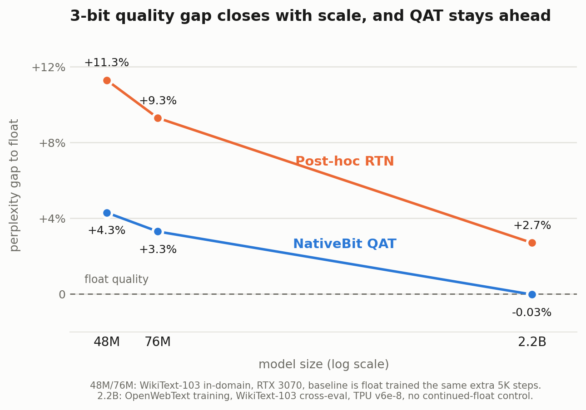

# NativeBit

[](https://github.com/NorthernLightx/NativeBit/actions/workflows/tests.yml)

Quantization-aware training for LLMs with per-block learned codebooks. At 2.2B parameters and 3-bit precision, a fine-tuned NativeBit model matches its float counterpart on WikiText-103 (30.50 vs 30.51 perplexity) while beating post-hoc RTN quantization (31.33). The packed model then decodes 1.9× faster than fp16 in 1.8 GB of weights, because 3-bit weights move fewer bytes through the memory system that single-token decode is bound by.



## Result

WikiText-103 perplexity, 2.2B model (26 layers, 2560 hidden, 6912 FFN; hidden and FFN sizes match BitNet b1.58-2B-4T).

| Method | 3-bit PPL | vs Float |
|--------|-----------|----------|
| Float baseline | 30.51 | 0% |
| Post-hoc RTN | 31.33 | +2.7% |
| NativeBit from-scratch (20K steps) | 34.23 | +12.2% |
| **NativeBit via QAT (5K steps)** | **30.50** | **−0.03%** |

QAT spends 5K steps that the float baseline never sees. At the two smaller scales below, where the control was affordable, giving float those same steps moves the comparison; this 2.2B table is the uncontrolled version, and the next section quantifies the direction.

The QAT recipe — load a trained float checkpoint, then fine-tune with NativeBit active for 5K steps using a commitment loss and canonical VQ-VAE EMA — is what closes the gap. Training NativeBit from scratch at this scale leaves a sizeable gap to float that post-hoc RTN doesn't have.

Compression: packed NativeBit 2.2B is 1.70 GB vs 8.76 GB float, about 5.1× smaller on disk.

### Smaller scales, one consumer GPU

The same recipe on an RTX 3070, WikiText-103 in-domain, PyTorch backend. The baseline here is the controlled one: float trained for the same 5K extra steps at the same learning rate, so both sides see the same token budget.

| Test PPL, 3-bit | 48M | 76M |
|-----------------|-----|-----|
| Float + 5K (baseline) | 23.36 | 22.09 |
| Post-hoc RTN | 25.99 (+11.3%) | 24.15 (+9.3%) |
| Post-hoc k-means | 26.56 (+13.7%) | 24.64 (+11.5%) |
| **NativeBit QAT** | **24.36 (+4.3%)** | **22.81 (+3.3%)** |

The control changes the picture in both directions. Those extra steps buy the float model a little perplexity, so QAT's gap to float is wider than it looks against the shorter baseline. They also spread the weight distribution slightly, which makes post-hoc quantization worse (RTN goes from +9.0% to +11.3% at 48M). QAT co-adapts to the codebook instead, so its margin over the best post-hoc method grows to 7.0 points at 48M and 6.0 at 76M.

Gap to float shrinks with scale: +4.3% at 48M, +3.3% at 76M, −0.03% at 2.2B.

The 2.2B row in the first table predates this control and can't be re-run without the TPU it was trained on, so its baseline is the shorter one. The two local points bound how much that matters. The continued-float gain shrinks with scale (1.48% at 48M, 0.76% at 76M) while the damage to post-hoc quantization stays flat (+2.24 and +2.27 points). Applying the same control at 2.2B would therefore move NativeBit's gap up by well under a point and RTN's by about two, which widens the margin rather than closing it. That is an extrapolation from two points, not a measurement.

Earlier versions of this README compared against float trained only to the checkpoint QAT starts from, which put the local gaps at +2.7% and +2.5%. The numbers above use the continued-float baseline instead and supersede those.

### Downstream tasks

Perplexity parity can hide capability loss, so the 2.2B QAT model was also run on full test sets:

| Task | Float fp16 | NativeBit QAT 3-bit | Gap |
|------|-----------|---------------------|-----|
| LAMBADA (5,153) | 29.79% | 29.65% | −0.14 pt |
| HellaSwag (10,042) | 30.60% | 30.44% | −0.16 pt |

Both gaps are noise at these sample sizes. The absolute numbers are low because the model saw 1.3B training tokens, far short of what these benchmarks usually assume; the claim here is the gap, not the score.

## What NativeBit does

Weights are quantized to one of `K` learned values per block (default `K=8`, `block_size=128`, i.e. 3-bit). The codebook entries are trainable and updated via EMA of raw sums and counts (canonical VQ-VAE style). Forward pass uses the quantized values; gradients flow to latent floats via straight-through estimation.

Three ingredients make the training converge to float quality:

1. Commitment loss $\lambda \cdot (\sum \lVert w - \mathrm{sg}(Q(w)) \rVert^2) / n_{\text{layers}}$ pulls latent weights onto codebook entries, reducing STE bias so forward and backward agree near the fixed point. Normalizing by layer count rather than weight count is why $\lambda \approx 1$ works; a per-weight mean would need $\lambda$ of order $10^4$.
2. Canonical VQ-VAE EMA updates each codebook entry from raw per-entry sums and counts rather than from EMA-ed batch means. That count-weights the update correctly when clusters have uneven population, instead of treating a 1-sample and a 100-sample batch alike.
3. QAT from a trained float checkpoint instead of from-scratch. Decouples "learn the task" from "adapt to the quantization constraint."

Embeddings, LM head, and RMSNorm parameters stay in float. Only the dense matmuls in attention and SwiGLU are quantized.

## Code layout

```
nativebit_jax/         JAX/Flax backend (TPU training at 2.2B scale)
  layers.py            NativeBitDense + compute_quant_reg + canonical EMA
  model.py             LLaMA-style transformer (RoPE, RMSNorm, SwiGLU)
  train.py             Training loop with QAT init, commitment loss,
                       periodic validation, full-config JSONL logging
  codebook_utils.py    Codebook init + EMA helpers
nativebit/             PyTorch backend (local GPU training, same QAT recipe)
inference/             Packed inference (CUDA dequant kernel, CUDA-graph decode)
configs/tpu.py         Model configs (25M → 2.2B)
benchmarks/            Post-hoc quantization baselines for comparison
tests/                 Unit tests (attention, quant-reg, canonical EMA, QAT init)
infra/                 TPU provisioning + training launch scripts
```

The two key files are `nativebit_jax/layers.py` (NativeBitDense + `requantize_params` + `compute_quant_reg` + `compute_quant_diagnostics`) and `nativebit_jax/train.py` (the training loop). The JAX backend is the primary one — it's what produced the paper results on v6e-8 TPU. The PyTorch backend is maintained for local GPU iteration.

## Install

Python 3.10–3.12. No HuggingFace Transformers, no GPTQ/AWQ libraries; the model, the quantizer, and the kernels are all in this repo.

```bash
git clone https://github.com/NorthernLightx/NativeBit && cd NativeBit
pip install -e .

# PyTorch backend (local GPU): torch>=2.0, tiktoken, matplotlib, tqdm
# JAX backend (TPU):           pip install -e ".[jax]"
# Test extras:                 pip install -e ".[ci]"
```

Packed-inference kernels are compiled on first use and need a CUDA toolkit plus a host compiler (MSVC on Windows, gcc on Linux). Everything else runs on CPU, slowly. Local training results here came from an RTX 3070 with 8 GB; the 2.2B runs came from a TPU v6e-8.

## Reproducing

### Float baseline (2.2B, ~7h on v6e-8)

```bash
python -m nativebit_jax.train \
    --config tpu-2b --dataset openwebtext \
    --no-nativebit --name 2b_float
```

### NativeBit from-scratch (2.2B, ~7h on v6e-8)

```bash
python -m nativebit_jax.train \
    --config tpu-2b --dataset openwebtext --name 2b_nb
```

Lands at +12.2% above float on WikiText-103 cross-eval at 3-bit — not competitive with post-hoc RTN. Used here as an ablation; for real quality use QAT.

### NativeBit via QAT (2.2B, ~2h on v6e-8)

```bash
python -m nativebit_jax.train \
    --config tpu-2b --dataset openwebtext --name 2b_nb_qat \
    --max-steps 5000 \
    --init-from logs/2b_float_params.npz \
    --lr 1e-4 --weight-decay 0.01 \
    --warmup-steps 200 --delay-quant-steps 0 --ema-decay 0.99 \
    --quant-reg-weight 1.0 --use-canonical-ema \
    --val-every 500
```

Matches float PPL on WikiText-103.

### Post-hoc baseline comparison

```bash
python benchmarks/benchmark_posthoc_2b.py --ckpt logs/2b_float_params.npz
```

## Tests

```bash
pip install -e ".[ci]"
JAX_PLATFORMS=cpu pytest tests/
```

Covers the cross-position attention regression, canonical VQ-VAE EMA,
commitment-loss gradient, QAT init key translation (JAX); and
NativeBitLinear/NativeBitGPT/pack/generate/data/training-step (PyTorch).
CI runs the equivalent on every push — `pytest tests/ -v` with
`JAX_PLATFORMS=cpu` across Python 3.10–3.12 (`.github/workflows/tests.yml`).

Standalone diagnostic scripts that need real checkpoints or TPU hardware
(stale-cache drift analysis, FSDP sharding, Pallas/Triton kernels) live
in `scripts/debug/` and are run manually, not under pytest.

## Training logs

Each run writes a JSONL log. Example records (one of each type):

```jsonl
{"type": "header", "schema_version": 2, "git_hash": "658c381", "argv": [...], "config": {...}, "init_from": "logs/2b_float_params.npz"}
{"type": "init_eval", "step": 0, "val_ppl": 18.98, "val_loss": 2.94, "val_batches": 64}
{"step": 100, "loss": 2.94, "perplexity": 18.82, "quant_err_rms": 0.0036, "cb_utilization": 1.0, "dead_frac": 0.0, "quant_reg": 206.5, "lambda": 0.08}
{"step": 500, "loss": 2.89, "perplexity": 17.98, "val_loss": 2.93, "val_ppl": 18.67, "val_batches": 32}
{"type": "eval", "test_ppl": 18.40, "wt103_test_ppl": 30.50, "total_time_s": 7400.0}
```

- `quant_reg` and `lambda` appear only when commitment loss is on.
- `val_ppl`, `val_loss`, `val_batches` appear on per-step records at `step % val_every == 0`.
- Everything in the header is JSON-serialisable, including the full dataclass config.

`compute_quant_diagnostics(params)` in `layers.py` is a pure function returning `{quant_error_rms, codebook_utilization, dead_entries_frac}` for any params tree. Useful for ad-hoc monitoring outside the training loop.

## Inference

Training checkpoints pack into a minimal format: per-block 3-bit-packed indices + fp32 codebook tables + unquantized embeddings/norms. The 2.2B model packs to 1.70 GB, about 5.1× smaller than the 8.76 GB fp32 float checkpoint.

```bash
# Pack a trained NativeBit checkpoint
python inference/pack.py logs/2b_nb_qat_params.npz --out inference/2b_nb.nbpack.npz

# Generate (JAX / TPU / CPU)
python inference/generate.py inference/2b_nb.nbpack.npz --packed --benchmark

# Generate with CUDA-graph decode (PyTorch, GPU)
python inference/graph_decode.py inference/2b_nb.nbpack.npz --n-generate 256

# Float vs NativeBit decode comparison
python inference/bench_decode_2b.py --nb inference/2b_nb.nbpack.npz \
    --float-npz logs/2b_float_params.npz
```

Decode never materializes a weight matrix. A fused CUDA kernel reads 3-bit packed indices straight from VRAM and dequantizes in registers, and the whole per-token step is captured as a CUDA graph so it replays in one launch instead of ~130.

2.2B on an RTX 3070, greedy decode, median of three warmed runs:

| | NativeBit 3-bit | Float fp16 |
|--|-----------------|-----------|
| Weights | 1.80 GB | 4.38 GB |
| Peak VRAM | 2.84 GB | 5.00 GB |
| Time to first token | 49 ms | 75 ms |
| Decode | 123.2 tok/s (8.1 ms/tok) | 66.1 tok/s (15.1 ms/tok) |

Two things dominate that decode number. Single-token matmuls are bandwidth-bound, so reading 0.44 bytes per weight instead of 2 is most of the win; the kernel sustains about 300 GB/s of the card's 448 GB/s peak, and Nsight puts both the memory and compute pipes near 80%, which is where a kernel stops being worth tuning. The rest is launch overhead: eager PyTorch decode spends roughly 95% of its wall clock in Python and kernel launches, which the graph removes.

Benchmark carefully on a desktop GPU. The first timed decode after idle runs at a third of steady-state speed while clocks ramp from 210 MHz to about 1920 MHz, which is enough to produce contradictory numbers for identical code. Warm up first, then take a median.

## Architecture notes

JAX's `jax.nn.dot_product_attention(q, k, v, is_causal=True)` with input layout `(B, H, T, D)` computes attention across heads, not positions. An early version of this code shipped that bug. The current code uses an explicit `einsum` with an fp32 softmax for stability under NativeBit quantization. If you swap attention, add a context-sensitivity probe: `KL(predict(full_context), predict(single_token)) > 0.1` confirms the model actually uses context. The broken version gave 0.0001.

The forward computes

$$W_q = W + \mathrm{sg}\left(Q(W_{\text{cached}}) - W_{\text{cached}}\right)$$

rather than $Q(W)$ directly. That lets the quantization cache refresh every `requantize_every` steps (default 10) instead of every step, which matters for throughput. Commitment loss keeps the latent weights close enough to codebook entries that stale-cache drift stays small between refreshes.

The biggest matrix, the embedding, is left unquantized partly because it's tied to the LM head, and a tied embedding needs different quantization treatment than a plain dense layer. That was a scope decision, not a fundamental limit.

## Caveats

Three scales: 48M and 76M locally in PyTorch, 2.2B on TPU in JAX. The two backends are checked against each other by unit test (`tests/test_qat_torch_parity.py` pins the PyTorch canonical EMA and commitment loss to the JAX reference within 1e-4), but no single model has been trained on both. The 125M and 350M results in git history used an earlier JAX implementation with the cross-head/cross-position attention bug; they don't reproduce and shouldn't be cited.

The 48M and 76M points are in-domain WikiText-103, the 2.2B point is OpenWebText training with WikiText-103 cross-eval. Perplexities are not comparable across those two settings; the gap to float is.

QAT is the recommended recipe. NativeBit from-scratch at 2.2B lands +12.2% above float at 3-bit, which is worse than post-hoc RTN. The method's claim is "trainable quantization that matches float via short fine-tuning," not "matches float from random init."

2-bit untested with fixed attention. The earlier 2-bit wins over k-means post-hoc came from pre-fix runs.

Single seed per point, and no multi-seed variance estimate at the local scales. Other domains (code, multilingual) are not measured.

Baseline numbers in the table come from a 2026-04-18 validation: float, RTN, and k-means rows from `benchmarks/benchmark_posthoc_2b.py` on `2b_float_fixed_params.npz`; the from-scratch and QAT WikiText-103 cross-evals from their respective training logs. A fresh single-CPU re-eval of the float baseline lands at 30.50 (consistent with 30.51 within eval-protocol noise). Running the full post-hoc sweep at 2.2B needs more than ~32 GB host RAM or a TPU — the script holds the float and quantized params live simultaneously.

## References

- **BitNet b1.58** (the ternary-LLM method NativeBit is benchmarked against): Ma et al., "The Era of 1-bit LLMs: All Large Language Models are in 1.58 Bits," 2024. [arxiv.org/abs/2402.17764](https://arxiv.org/abs/2402.17764)
- **BitNet b1.58 2B4T** (the 2B model whose hidden/FFN width this config matches): Ma et al., "BitNet b1.58 2B4T Technical Report," 2025. [arxiv.org/abs/2504.12285](https://arxiv.org/abs/2504.12285)
- **VQ-VAE** (origin of the EMA codebook update used here, Appendix A.1): van den Oord et al., "Neural Discrete Representation Learning," 2017. [arxiv.org/abs/1711.00937](https://arxiv.org/abs/1711.00937)
- **Straight-through estimator**: Bengio et al., "Estimating or Propagating Gradients Through Stochastic Neurons for Conditional Computation," 2013. [arxiv.org/abs/1308.3432](https://arxiv.org/abs/1308.3432)

## License

MIT
